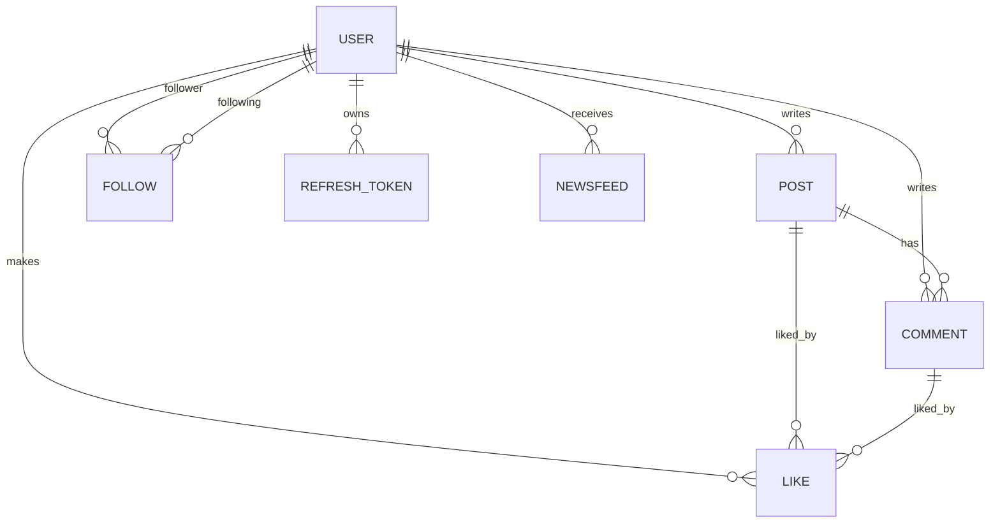

## 프로젝트 개요
SNS 백엔드 API 서버입니다. 사용자 인증, 포스트/댓글/좋아요, 팔로우 및 뉴스피드를 제공합니다.

---

## 프로젝트 핵심 목표
- 이메일 인증 기반 회원가입과 보안 강화
- JWT 인증 + Refresh Token을 통한 안전한 세션 관리
- 팔로우 기반 뉴스피드 제공

---

## 서비스 구성
- 사용자: 회원가입/로그인/로그아웃/프로필·비밀번호 수정
- 포스트: 작성/수정/삭제/조회
- 댓글: 작성/수정/조회
- 좋아요: 포스트/댓글 좋아요
- 팔로우: 팔로우 생성 및 뉴스피드 반영
- 뉴스피드: 활동 타입별 필터링, 최신순 조회

---

## 기술 스택
- Back-End: Java 17, Spring Boot 3.x, Spring Security
- 인증: JWT (Access/Refresh)
- ORM: Spring Data JPA
- Database: MySQL
- Infra: Docker
- 기타: Firebase Storage(프로필 이미지), JavaMail(이메일 인증)

---

## 아키텍처
- Presentation: Controller + DTO
- Domain: Entity + Service
- Infrastructure: Repository
- 인증 흐름: Access Token 검증 + Refresh Token DB 저장

---

## ERD (요약)


핵심 엔티티: User, Post, Comment, Like, Follow, Newsfeed, RefreshToken, EmailAuth

---

## 프로젝트 구조
```
src/main/java/com/sns/platform/api
├─ common
├─ config
├─ module
│  ├─ comment
│  ├─ follow
│  ├─ like
│  ├─ newsfeed
│  ├─ post
│  └─ user
└─ SnsPlatformApiApplication.java
```
